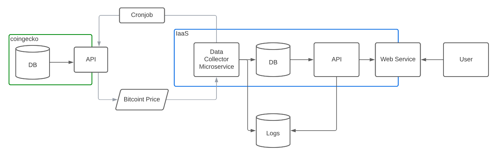
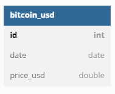

# Coding Challenge - Bitcoint Price

---

Repository : coding_challenge_bitcoin

---

## Objective

Develop an automated and scalable process to obtain the **average** of each 5 days (moving average) of the price of bitcoin in the **first quarter of 2022**.

## Brief

The finance team needs to analyze the behavior of bitcoin to know if it is feasible to invest in that currency. Your task is to obtain this information in an automated way and be prepared for sudden changes that must be made at the moment.

## Tasks

- Explore Crypto API
  - link: <https://www.coingecko.com/en/api/documentation>
- Get a list of all coins with id, name and symbol (using Crypto API)
  - Get bitcoin coin id
- Get the price of bitcoin in usd and by date of the first quarter of 2022 (using Crypto API)
  - Save the information in the database of your choice
- Consume the data previously persisted in the database to make a window/partition function for every 5 days (spark or pandas)
  - Extra point: Save the information in the database of your choice
- Add your code on github repository
  - Share the link before the interview
- Extra point: using the tool of your choice show the results obtained in a grap

---

## Architecture

---

### Tech Stack

- Python as ETL, DataProcessing and API (predecesor to microservice)
- Jupyter Notebooks for Dev. Python script for Prod
- SQLite as Database in the meantine. To facilitate hosting and potability in IaaS
- Javascript/ Node.js as backend/frontend to build platform of data consuption.
- Linux/Ubuntu 20.04 LTS as OS
- Cron job to automate ETL
- AWS as PaaS/IaaS as a firt version

### Scalable version

- ETL -> Lambda Function (FaaS, Serverless in AWS)
- API -> AWS Api Gateway and Lambda (FaaS, Serverless in AWS)
- SQLite -> RDS (AWS, database service)
- Javascript/Node.js Back/Front -> Tableau, PowerBI
- Javascript/Node.js Back/Front -> IaaS
- Cron job -> Airflow
- AWS Iaas -> AWS PaaS

### Data Flow

### Database ERD

#### TODO

- Better SQL Query at api.py

Future steps to full solution:

- Sizing
- CI/ CD
- Data Lifecycle
- Data Quality
- Business Continuity Plan (BCP) & Disaster Recovery Plan (DRP)
- Logging and monitoring (Dynatrace)
- Data profiling (Finance team)
- Load balancer, Gatekeeper and Gateway for API -> Apigee
- Real time data? Kafka
- Microservice? Docker, Kubernetes